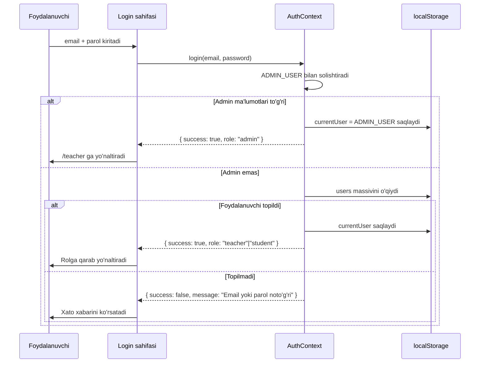

# Dizayn Hujjati: Admin Roli va Markazlashgan Autentifikatsiya Tizimi

## Umumiy Ko'rinish (Overview)

Ushbu dizayn `admin-auth-system` funksiyasini amalga oshirish uchun texnik yechimni belgilaydi. Loyiha React 19 + Vite asosidagi frontend-only ta'lim platformasi bo'lib, hozirda `teacher` va `student` rollari mavjud.

**Asosiy o'zgarishlar:**

1. **Hardcoded admin hisobi** — `AuthContext` ichida sabit qiymat sifatida saqlanadi, `localStorage`-ga yozilmaydi
2. **Markazlashgan foydalanuvchi yaratish** — faqat admin teacher va student qo'sha oladi
3. **Register sahifasini bloklash** — `/register` marshruti o'chiriladi, redirect qo'shiladi
4. **Admin paneli kengaytirish** — mavjud `AddTeacherPage` ni `AdminPanel` ga aylantirish (teacher + student boshqaruvi)
5. **Rol asosida yo'naltirish** — login qilgandan so'ng rol bo'yicha avtomatik yo'naltirish
6. **Sessiyani saqlash** — `localStorage.currentUser` orqali sahifa yangilanishida sessiya tiklanadi

**Mavjud kod bilan munosabat:**

Loyihada allaqachon quyidagilar mavjud:
- `AuthContext.jsx` — `login`, `register`, `addTeacher`, `logout` funksiyalari bor
- `AddTeacherPage.jsx` — teacher qo'shish va o'chirish UI si mavjud
- `ProtectedRoute.jsx` — rol asosida himoya mavjud
- `TeacherLayout.jsx` — admin uchun "O'qituvchi qo'shish" havolasi shartli ko'rsatiladi

Dizayn mavjud kodga minimal o'zgarish kiritib, talablarni to'liq qondiradi.

---

## Arxitektura (Architecture)

```mermaid
graph TD
    A[Foydalanuvchi] -->|/login| B[Login sahifasi]
    A -->|/register| C[Redirect → /login]
    
    B -->|login()| D[AuthContext]
    D -->|admin| E[/teacher - Admin Panel]
    D -->|teacher| F[/teacher - Teacher Panel]
    D -->|student| G[/student - Student Panel]
    
    D -->|ADMIN_USER hardcoded| H[In-memory Admin]
    D -->|users| I[(localStorage: users)]
    D -->|currentUser| J[(localStorage: currentUser)]
    
    E -->|addUser()| I
    E -->|deleteUser()| I
    E -->|listUsers()| I
    
    K[ProtectedRoute] -->|rol tekshirish| D
    K -->|ruxsatsiz| B
```

**Arxitektura qarorlari:**

- **Frontend-only**: Backend yo'q, barcha ma'lumotlar `localStorage`-da saqlanadi
- **Context API**: Global holat boshqaruvi uchun React Context ishlatiladi
- **Hardcoded admin**: Admin hisob ma'lumotlari `AuthContext` ichida `ADMIN_USER` konstantasi sifatida saqlanadi — `localStorage`-ga yozilmaydi
- **Mavjud UI uslubi**: Yangi admin paneli mavjud `AddTeacherPage` uslubida quriladi (ko'k tugmalar, avatar, qizil o'chirish tugmasi)

---

## Komponentlar va Interfeyslar (Components and Interfaces)

### 1. `AuthContext` (o'zgartiriladi)

**Fayl:** `src/context/AuthContext.jsx`

```
ADMIN_USER (konstanta):
  id: "admin"
  name: "Admin"
  email: "qosimovamuxlisaxon04@gmail.com"
  password: "hasanova4"
  role: "admin"
```

**Eksport qilinadigan funksiyalar:**

| Funksiya | Parametrlar | Qaytaradi | Tavsif |
|---|---|---|---|
| `login(email, password)` | string, string | `{ success, role, message? }` | Avval ADMIN_USER bilan solishtiradi, keyin localStorage |
| `logout()` | — | void | currentUser o'chiriladi, /login ga yo'naltiradi |
| `addUser(userData)` | `{ name, email, password, role }` | `{ success, message? }` | Faqat admin chaqira oladi; teacher yoki student qo'shadi |
| `deleteUser(userId)` | string | `{ success, message? }` | Faqat admin chaqira oladi; admin o'chirilmaydi |
| `getUsers()` | — | User[] | localStorage-dagi barcha teacher va student lar |
| `register` | — | `{ success: false }` | Bloklangan — har doim muvaffaqiyatsiz qaytaradi |

> **Eslatma:** `addTeacher` funksiyasi `addUser` ga o'zgartiriladi va `role` parametrini qabul qiladi.

### 2. `AdminPanel` (yangi sahifa)

**Fayl:** `src/pages/admin/AdminPanel.jsx`

Mavjud `AddTeacherPage.jsx` asosida quriladi, lekin teacher va student ikkisini ham boshqaradi.

**Tarkibi:**
- Rol tanlash tab-lari: "O'qituvchi" | "O'quvchi"
- Foydalanuvchi qo'shish formasi (ism, email, parol)
- Foydalanuvchilar ro'yxati (avatar, ism, email, rol, o'chirish tugmasi)
- Muvaffaqiyat modali
- Tasdiqlash modali (o'chirishdan oldin)

**Props:** yo'q (AuthContext orqali ma'lumot oladi)

### 3. `ProtectedRoute` (kengaytiriladi)

**Fayl:** `src/routes/ProtectedRoute.jsx`

Hozirgi holat: `allowedRole` prop qabul qiladi.

O'zgarish: Mantiq o'zgartirilmaydi, faqat `App.jsx` dagi marshrutlar yangilanadi.

### 4. `Login` sahifasi (kichik o'zgarish)

**Fayl:** `src/pages/Login/Login.jsx`

O'zgarish: "Hisobingiz yo'qmi? Ro'yxatdan o'ting" havolasi olib tashlanadi.

### 5. `App.jsx` (marshrut o'zgarishlari)

- `/register` marshruti `<Navigate to="/login" replace />` ga o'zgartiriladi
- `/teacher/add-teacher` marshruti `/teacher/admin` ga o'zgartiriladi yoki yangi admin marshruti qo'shiladi

### 6. `TeacherLayout` (kichik o'zgarish)

Admin uchun sidebar havolasi "O'qituvchi qo'shish" o'rniga "Foydalanuvchilar boshqaruvi" bo'ladi.

---

## Ma'lumotlar Modellari (Data Models)

### User (Foydalanuvchi)

```typescript
interface User {
  id: string | number;       // "admin" (admin uchun) | Date.now() (boshqalar uchun)
  name: string;              // To'liq ism
  email: string;             // Unikal email manzil
  password: string;          // Oddiy matn (frontend-only loyiha)
  role: "admin" | "teacher" | "student";
}
```

### ADMIN_USER (Hardcoded Konstanta)

```javascript
const ADMIN_USER = {
  id: "admin",
  name: "Admin",
  email: "qosimovamuxlisaxon04@gmail.com",
  password: "hasanova4",
  role: "admin"
};
```

> Admin `localStorage`-dagi `users` massiviga **yozilmaydi**. Faqat `AuthContext` ichida konstanta sifatida mavjud.

### localStorage Sxemasi

```
localStorage:
  "users"       → User[]   (faqat teacher va student lar; admin yo'q)
  "currentUser" → User     (joriy kirgan foydalanuvchi; sahifa yangilanishida tiklanadi)
```

### Login Natijasi

```typescript
interface LoginResult {
  success: boolean;
  role?: "admin" | "teacher" | "student";
  message?: string;  // Xato bo'lganda
}
```

### AddUser Natijasi

```typescript
interface AddUserResult {
  success: boolean;
  message?: string;  // Xato bo'lganda: "Bu email allaqachon mavjud", "Ruxsat yo'q" va h.k.
}
```

### Login Oqimi (Login Flow)



---

## To'g'rilik Xossalari (Correctness Properties)

*Xossa — bu tizimning barcha to'g'ri bajarilishlarida rost bo'lishi kerak bo'lgan xususiyat yoki xatti-harakat. Xossalar inson o'qiy oladigan spetsifikatsiyalar bilan mashina tomonidan tekshiriladigan to'g'rilik kafolatlari o'rtasidagi ko'prik vazifasini bajaradi.*

**Property Reflection (Redundansiyani bartaraf etish):**

Prework tahlilidan so'ng quyidagi birlashtirish qarorlari qabul qilindi:
- 4.2 va 4.3 (teacher/student login yo'naltirish) → Xossa 4 ga birlashtirildi
- 4.5, 4.6, 4.7 (ProtectedRoute bloklash) → Xossa 9 ga birlashtirildi
- 2.1 va 2.2 (teacher/student qo'shish) → Xossa 10 ga birlashtirildi
- 1.2, 1.3, 1.5 (admin localStorage-da yo'q) → Xossa 2 ga birlashtirildi

---

### Xossa 1: Login sessiya round-trip

*Har qanday* to'g'ri email va parol juftligi uchun (admin, teacher yoki student), `login()` muvaffaqiyatli bo'lganda `localStorage.currentUser` dagi saqlangan foydalanuvchi ma'lumotlari kirish uchun ishlatilgan foydalanuvchi ma'lumotlariga to'liq mos kelishi kerak.

**Validates: Requirements 6.1, 6.2**

---

### Xossa 2: Admin localStorage-ga hech qachon yozilmaydi

*Har qanday* tizim operatsiyasi (foydalanuvchi qo'shish, o'chirish, login, logout) bajarilgandan so'ng, `localStorage`-dagi `users` massivi admin hisobini o'z ichiga olmasligi kerak — admin faqat `ADMIN_USER` konstantasi orqali mavjud bo'lishi kerak.

**Validates: Requirements 1.2, 1.3, 1.5**

---

### Xossa 3: Email unikalligi

*Har qanday* foydalanuvchi qo'shish so'rovi uchun, agar `localStorage`-da bir xil email allaqachon mavjud bo'lsa, `addUser()` `{ success: false }` qaytarishi va foydalanuvchilar soni o'zgarmasligi kerak.

**Validates: Requirements 2.3**

---

### Xossa 4: Muvaffaqiyatli login rol qaytaradi

*Har qanday* to'g'ri email va parol juftligi uchun (teacher yoki student), `login()` `{ success: true, role }` qaytarishi va `role` qiymati foydalanuvchining haqiqiy roliga mos kelishi kerak.

**Validates: Requirements 4.2, 4.3**

---

### Xossa 5: Noto'g'ri login bloklash

*Har qanday* noto'g'ri email yoki parol kombinatsiyasi uchun (tizimda mavjud bo'lmagan yoki parol mos kelmaydigan), `login()` `{ success: false }` qaytarishi va `localStorage.currentUser` o'zgarmasligi kerak.

**Validates: Requirements 4.4**

---

### Xossa 6: Foydalanuvchi o'chirish round-trip

*Har qanday* mavjud teacher yoki student uchun, `deleteUser(id)` chaqirilgandan so'ng, `getUsers()` o'chirilgan foydalanuvchini qaytarmasligi va foydalanuvchilar soni bittaga kamayishi kerak.

**Validates: Requirements 5.4**

---

### Xossa 7: Parol uzunligi validatsiyasi

*Har qanday* 6 belgidan qisqa parol uchun (0 dan 5 gacha uzunlik), `addUser()` `{ success: false }` qaytarishi va foydalanuvchi yaratilmasligi kerak.

**Validates: Requirements 2.5**

---

### Xossa 8: Logout round-trip

*Har qanday* kirgan foydalanuvchi uchun, `logout()` chaqirilgandan so'ng `localStorage.currentUser` yo'q bo'lishi va `AuthContext` dagi `user` holati `null` bo'lishi kerak.

**Validates: Requirements 6.3**

---

### Xossa 9: ProtectedRoute rol asosida bloklash

*Har qanday* foydalanuvchi uchun, o'z roliga mos bo'lmagan himoyalangan sahifaga kirishga urinish (student → `/teacher`, teacher → `/student`, kirish qilinmagan → har qanday himoyalangan sahifa) bloklangan bo'lishi kerak.

**Validates: Requirements 4.5, 4.6, 4.7**

---

### Xossa 10: Foydalanuvchi qo'shish round-trip

*Har qanday* to'g'ri foydalanuvchi ma'lumotlari (ism, unikal email, 6+ belgili parol, teacher yoki student roli) uchun, `addUser()` muvaffaqiyatli bo'lgandan so'ng `getUsers()` yangi foydalanuvchini qaytarishi kerak.

**Validates: Requirements 2.1, 2.2**

---

### Xossa 11: Register funksiyasi bloklangan

*Har qanday* foydalanuvchi ma'lumotlari bilan `register()` chaqirilganda, funksiya `{ success: false }` qaytarishi va `localStorage.users` o'zgarmasligi kerak.

**Validates: Requirements 3.3**

---

## Xatolarni Boshqarish (Error Handling)

### Login xatolari

| Holat | Xato xabari | Harakat |
|---|---|---|
| Email topilmadi | "Email yoki parol noto'g'ri" | Forma tozalanmaydi, foydalanuvchi qayta urinishi mumkin |
| Parol noto'g'ri | "Email yoki parol noto'g'ri" | Xavfsizlik uchun email/parol farqi ko'rsatilmaydi |
| Bo'sh maydonlar | HTML `required` atributi | Forma yuborilmaydi |

### Foydalanuvchi qo'shish xatolari

| Holat | Xato xabari | Harakat |
|---|---|---|
| Email allaqachon mavjud | "Bu email allaqachon mavjud" | Forma tozalanmaydi |
| Noto'g'ri email format | "Noto'g'ri email format" | HTML `type="email"` + qo'shimcha tekshiruv |
| Parol 6 belgidan qisqa | "Parol kamida 6 belgidan iborat bo'lishi kerak" | Forma yuborilmaydi |
| Ruxsatsiz foydalanuvchi | "Sizda ruxsat yo'q" | Admin bo'lmagan foydalanuvchi bu funksiyaga kira olmaydi |

### Sessiya xatolari

| Holat | Harakat |
|---|---|
| `currentUser` buzilgan JSON | `try/catch` bilan ushlanadi, `logout()` chaqiriladi, `/login` ga yo'naltiriladi |
| `users` massivi buzilgan | Bo'sh massiv `[]` sifatida ishlatiladi |

### Marshrut himoyasi

| Holat | Harakat |
|---|---|
| Kirish qilinmagan, himoyalangan sahifa | `/login` ga yo'naltirish |
| Student `/teacher` ga kirmoqchi | `/` ga yo'naltirish |
| Teacher `/student` ga kirmoqchi | `/` ga yo'naltirish |
| `/register` ga kirish | `/login` ga yo'naltirish |

---

## Sinov Strategiyasi (Testing Strategy)

Bu loyiha frontend-only React ilovasi bo'lib, barcha mantiq `AuthContext` va komponentlar ichida joylashgan. Sinov strategiyasi ikki qatlamdan iborat:

### Birlik Testlari (Unit Tests)

Quyidagi holatlar uchun aniq misollar bilan sinov:

**AuthContext funksiyalari:**
- `login()` — to'g'ri admin ma'lumotlari bilan muvaffaqiyatli kirish
- `login()` — to'g'ri teacher ma'lumotlari bilan muvaffaqiyatli kirish
- `login()` — noto'g'ri parol bilan muvaffaqiyatsiz kirish
- `addUser()` — yangi teacher qo'shish
- `addUser()` — yangi student qo'shish
- `addUser()` — takroriy email bilan muvaffaqiyatsiz
- `deleteUser()` — mavjud foydalanuvchini o'chirish
- `deleteUser()` — admin o'chirishga urinish (muvaffaqiyatsiz)
- `logout()` — `currentUser` o'chirilishi

**Marshrut himoyasi:**
- Kirish qilinmagan holda himoyalangan sahifaga kirish → `/login`
- Student `/teacher` ga kirish → `/`
- Teacher `/student` ga kirish → `/`
- `/register` ga kirish → `/login`

### Xossa Asosidagi Testlar (Property-Based Tests)

Loyihada hozirda test framework mavjud emas. Xossa testlari uchun **Vitest** + **fast-check** kutubxonasi tavsiya etiladi:

```bash
npm install --save-dev vitest @vitest/ui fast-check
```

Har bir xossa testi kamida **100 iteratsiya** bilan ishga tushirilishi kerak.

**Test teglash formati:** `Feature: admin-auth-system, Property {N}: {xossa matni}`

#### Xossa 1: Login sessiya round-trip
```
// Feature: admin-auth-system, Property 1: Login session round-trip
// For any valid email/password pair, after login(), localStorage.currentUser matches the user data
```

#### Xossa 2: Admin localStorage-ga hech qachon yozilmaydi
```
// Feature: admin-auth-system, Property 2: Admin never in localStorage
// For any system operation, localStorage users array never contains admin account
```

#### Xossa 3: Email unikalligi
```
// Feature: admin-auth-system, Property 3: Email uniqueness
// For any addUser() call with existing email, returns { success: false } and user count unchanged
```

#### Xossa 4: Muvaffaqiyatli login rol qaytaradi
```
// Feature: admin-auth-system, Property 4: Successful login returns correct role
// For any valid teacher/student credentials, login() returns { success: true, role } matching actual role
```

#### Xossa 5: Noto'g'ri login bloklash
```
// Feature: admin-auth-system, Property 5: Invalid login blocked
// For any wrong email/password, login() returns { success: false } and currentUser unchanged
```

#### Xossa 6: Foydalanuvchi o'chirish round-trip
```
// Feature: admin-auth-system, Property 6: Delete round-trip
// For any existing user, after deleteUser(id), getUsers() does not contain that user
```

#### Xossa 7: Parol uzunligi validatsiyasi
```
// Feature: admin-auth-system, Property 7: Password length validation
// For any password shorter than 6 chars, addUser() returns { success: false }
```

#### Xossa 8: Logout round-trip
```
// Feature: admin-auth-system, Property 8: Logout round-trip
// For any logged-in user, after logout(), localStorage.currentUser is null and user state is null
```

#### Xossa 9: ProtectedRoute rol asosida bloklash
```
// Feature: admin-auth-system, Property 9: ProtectedRoute role-based blocking
// For any user accessing a route not matching their role, access is blocked and redirected
```

#### Xossa 10: Foydalanuvchi qo'shish round-trip
```
// Feature: admin-auth-system, Property 10: Add user round-trip
// For any valid user data (teacher/student), after addUser(), getUsers() contains the new user
```

#### Xossa 11: Register funksiyasi bloklangan
```
// Feature: admin-auth-system, Property 11: Register function blocked
// For any user data, register() always returns { success: false } and localStorage.users unchanged
```

### Qo'lda Sinov (Manual Testing)

Quyidagi stsenariylar qo'lda tekshirilishi kerak:
1. Admin sifatida kirish → admin paneli ko'rinishi
2. Teacher sifatida kirish → teacher paneli ko'rinishi (admin menyu yo'q)
3. Student sifatida kirish → student paneli ko'rinishi
4. `/register` URL-iga to'g'ridan-to'g'ri kirish → `/login` ga yo'naltirish
5. Sahifani yangilash → sessiya tiklanishi
6. "Chiqish" tugmasi → `/login` ga yo'naltirish
7. Admin teacher qo'shadi → ro'yxatda ko'rinadi
8. Admin student qo'shadi → ro'yxatda ko'rinadi
9. Admin foydalanuvchini o'chiradi → ro'yxatdan yo'qoladi
